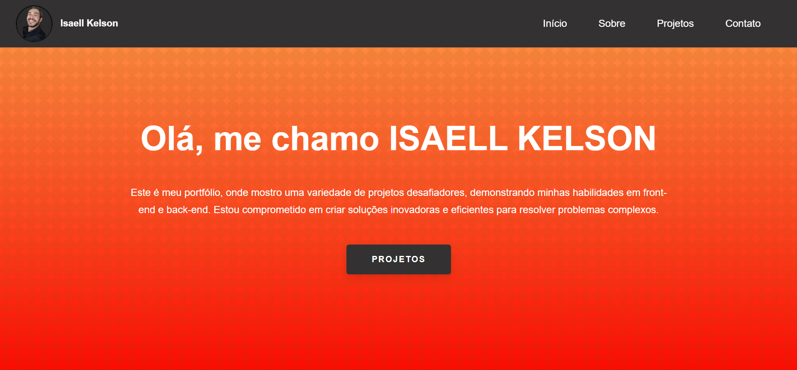

# Meu Portfólio

Este é o repositório do meu site portfolio, onde apresento meu trabalho como desenvolvedor web. O site foi construído utilizando JavaScript, HTML5, CSS e SASS para fornecer uma experiência de usuário atraente e interativa.

## Tecnologias Utilizadas

- **JavaScript**: Utilizado para adicionar funcionalidades interativas ao site.
- **HTML5**: Estruturação do conteúdo do site.
- **CSS**: Estilização básica.
- **SASS**: Utilizado para melhorar a manutenção e organização do código CSS.

## Funcionalidades

- Apresentação de projetos e trabalhos anteriores.
- Detalhes sobre minhas habilidades e experiência.
- Formulário de contato para oportunidades de colaboração.

## Como Executar o Projeto Localmente

1. Clone este repositório: git clone https://github.com/Isaell-Kelson/Portfolio.git
2. Navegue até a pasta do projeto: `cd Portfolio`
3. Abra o arquivo `index.html` no seu navegador preferido.

## Estrutura do Projeto

- `index.html`: Página inicial do site.
- `css/`: Pasta que contém os arquivos CSS e SASS.
- `js/`: Pasta que contém os arquivos JavaScript.

## Contribuindo

Se você gostaria de contribuir para este projeto, sinta-se à vontade para abrir uma issue ou enviar um pull request. Estou aberto a melhorias e sugestões!

## Licença

Este projeto está sob a licença [MIT](LICENSE.md).

## Review

